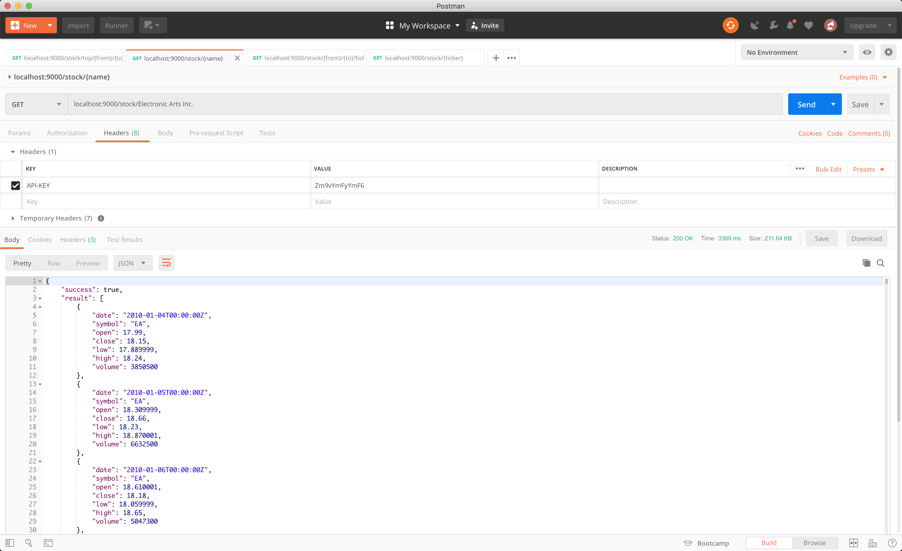
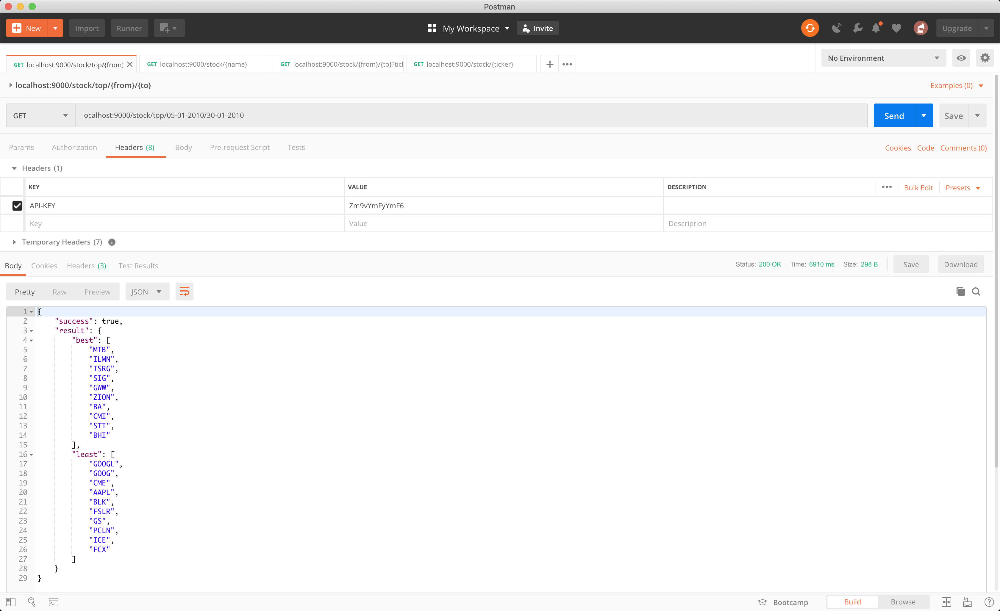
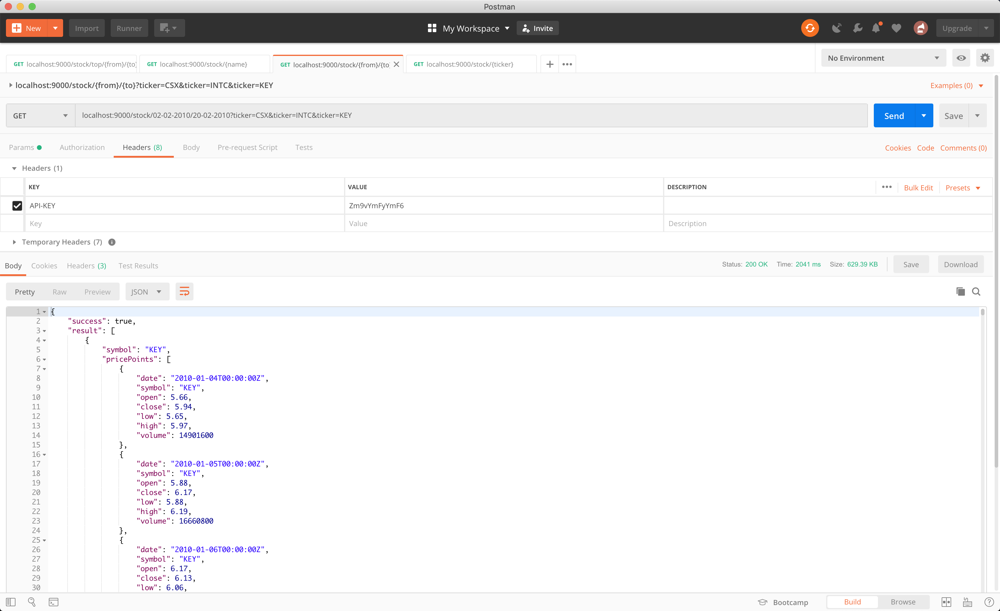
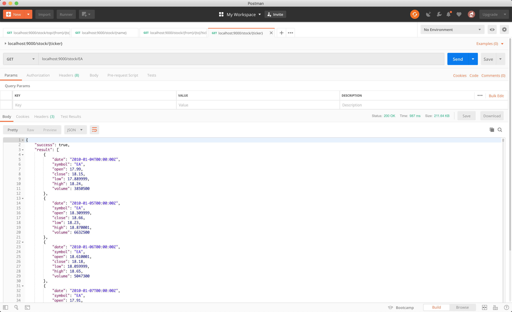

# trading

> trading backend

> Run pre built binary with default config (without any prerequisite):
- Windows
```bash
build/latest/stock_0.1_windows_amd64/stock.exe -config config/config.json
```  
- Linux
```bash
./build/latest/stock_0.1_linux_amd64/stock.exe -config config/config.json
```  
- Mac
```bash
./build/latest/stock_0.1_darwin_amd64/stock -config config/config.json
```  

> [Postman Collection](stock.postman_collection.json)

> [Postman Documentation](https://documenter.getpostman.com/view/60167/S1Lparfz)


## Prerequisites
- [Go](https://golang.org/dl/) version 1.11+
- [make](https://www.gnu.org/software/make/manual/make.html)

## Getting started

1. Install dependencies using `make install`
2. Export `GO111MODULE`
```bash
export GO111MODULE=on
```
3. Run the app using (This uses default config which connects to the default cloud mongodb database):

```bash
make run    
```

4. Please update the config file to run against your database:

 - Save the Stocks info [Xlsx](http://hck.re/oUVSlU) as CSV
 - Save the stock archives [data](http://hck.re/CPKVPp)
 - The path to these files must be passed if running against own database
 - The default config does not need data migration as it connects to the 
 cloud database which already has the imported data


## Development Scripts

Before running any development scripts, be sure to first install all the prerequisites.

#### Show all tools
```shell
$ make
```

#### Clean binaries
```shell
$ make clean
```

#### Run all tests
```shell
$ make test
```

#### Run all tests with coverage
```shell
$ make coverage
```

#### Run all tests with coverage opening HTML report in Browser
```shell
$ make coverage-html
```

#### Lint application
```shell
$ make lint
```

#### Cross compile application and create binaries inside build directory
```shell
$ make build
```

#### Cross compile application and create release artifacts inside build directory
```shell
$ make release
```

#### Run application with default config
```shell
$ make run
```

#### Import latest configuration
```shell
$ make migrate
```
or

```shell
$ go run cmd/migration/main.go -config config/config.json
```

## Implemented APIs

- companySearch API:



- timeFrame API:



- stocksInTime API:



- tickerSearch API:


